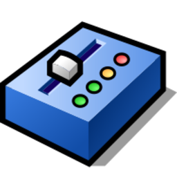
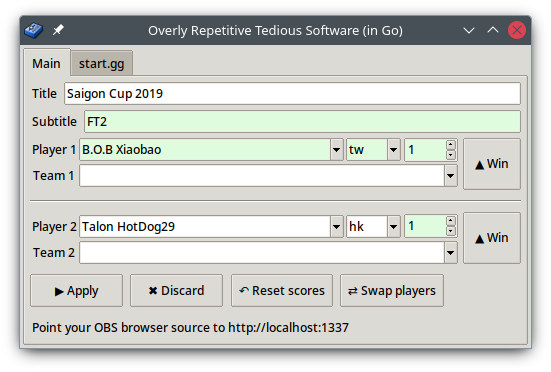
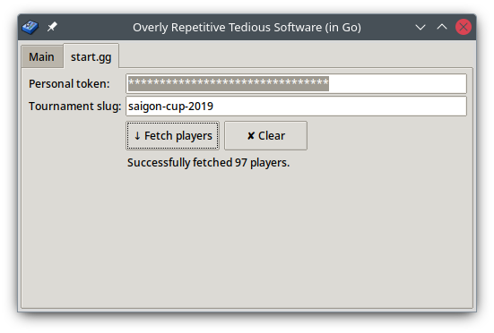

# Overly Repetitive Tedious Software (in Go)



[](https://builds.sr.ht/~nhanb/gorts/commits/master?)
[](https://github.com/nhanb/gorts/actions/workflows/release.yml)

GORTS is a simple scoreboard overlay for fighting games. The default design is
compatible with Street Fighter 6, Tekken 8, KOF XV, and Guilty Gear Strive.

It's a rewritten successor of [ORTS][1]. This version is written in Go and
Tcl/Tk, communicating via goold old pipes, the way Bell Labs intended.





# Features

GORTS is heavily inspired by [StreamControl](http://farpnut.net/streamcontrol/)
but has a bunch of opinionated quality-of-life improvements:

- **Visible diff & easy undo**: Changes not yet applied to stream are
  highlighted and can be discarded with the Discard button.

- **Player name + country import**: Currently supports start.gg.
  Player data is
  saved as a csv file which can then be updated manually using any (decent)
  spreadsheet editor.

- **Flexible player name suggestion as you type**: unlike StreamControl, you
  don't need to care about whitespaces, dots, dashes, or any non-alphanumeric
  characters.

- **Cross-platform**: Supports Windows & Linux. macOS support is unplanned but
  if you really need it, I'm open to contract work.

# Download

You can download from either of:

- [GitHub](https://github.com/nhanb/gorts/releases/latest): download
  `GORTS-Linux.zip` or `GORTS-Windows.zip`.
- [SourceHut](https://git.sr.ht/~nhanb/gorts/refs): click on the latest
  version (vX.X.X), download `GORTS-Linux-vX.X.X.zip` or
  `GORTS-Windows-vX.X.X.zip`.

# How to use

## Windows

Just unzip then:

- Run **gorts.exe**.
- Open OBS => Add browser source => Point to **http://localhost:1337**
- Browser size must be 1920x1080.
- If you want to manually tweak player names after importing from start.gg,
  edit **data/players.csv** with any text editor (notepad++) or spreadsheet
  editor (excel or [libreoffice calc][2])
- If you want to customize the look, open up the **web** folder and go wild.
  You only need basic HTML/CSS/JS knowledge to work on it. No fancy frameworks.

## Linux

Dependency: [tk](https://repology.org/project/tk/versions)
(we basically assume `tclsh` is available from $PATH)

Unzip, run `gorts` from the unzipped directory.

Proper packaging is not planned because I only develop on Linux and stream on
Windows. If you want to contribute then I'm happy to give pointers though.

# I got a virus warning?

GORTS is written in the Go programing language, which suffers from false
positives more often than usual. See <https://go.dev/doc/faq#virus>:

> Why does my virus-scanning software think my Go distribution or compiled
> binary is infected?
>
> This is a common occurrence, especially on Windows machines, and is almost
> always a false positive. Commercial virus scanning programs are often
> confused by the structure of Go binaries, which they don't see as often as
> those compiled from other languages.

So no, I'm not trying to hackerman you. If you're really concerned, feel free
to audit the code and compile GORTS yourself. There's really not that much
code.

# I want a custom design?

See "How to use":

> If you want to customize the look, open up the **web** folder and go wild.
> You only need basic HTML/CSS/JS knowledge to work on it. No fancy frameworks.

If you really need a custom design but can't implement it yourself, I'm open to
contract work. Contact me at <paid@imnhan.com>.

# Compile from source

Can cross-compile from any unix-like. I'm cheating a little though, by
downloading a prebuilt tcl executable for Windows, and just assume Linux users
have already installed tcl/tk.

Prerequisites: `make`, `go`, `curl`, `zip`.

```sh
make dist/GORTS-Linux.zip
make dist/GORTS-Windows.zip
```

See Makefile for details.

# License

Copyright (C) 2023 Bui Thanh Nhan

This program is free software: you can redistribute it and/or modify it under
the terms of the GNU General Public License version 3 as published by the Free
Software Foundation.

This program is distributed in the hope that it will be useful, but WITHOUT ANY
WARRANTY; without even the implied warranty of MERCHANTABILITY or FITNESS FOR A
PARTICULAR PURPOSE.  See the GNU General Public License for more details.

You should have received a copy of the GNU General Public License along with
this program.  If not, see <https://www.gnu.org/licenses/>.

# Dev notes

Tcl options on Windows:

- [TclKits](https://tclkits.rkeene.org/fossil/wiki/Downloads): single 5.8MiB
  binary
- [IronTcl](https://www.irontcl.com): 14.5Mib folder unzipped. Apparently
  IronTcl does text scaling perfectly out of the box (tested on Windows 10 with
  125% scaling), while tclkit gets blurry. <== currently used
- Manually compile? TODO

Web server should probably read state from memory instead of disk (state.json).
Sounds like premature optimization though.

A line-based wire format for IPC is simple, but inefficient: binary data (e.g.
in `geticon`) needs to be base64-encoded then decoded on the other side. I have
an experimental [netstrings](https://cr.yp.to/proto/netstrings.txt)-based
version on the `netstring` branch, but it's more awkward to implement in tcl
due to its binary pipe convention (defaults to iso8859-1 encoding).
Implementing netstrings was a fun exercise but, again, sounds like a premature
optimization in this use case. Keeping it simple for now.

# Credits

## Design

Just like ORTS, the out-of-the-box design in GORTS was done by
[hismit](https://twitter.com/hismit3rd).

## Icon

GORTS's icon was lifted verbatim from Haiku OS:
https://github.com/darealshinji/haiku-icons/blob/master/svg/App_MidiPlayer.svg

The following is its original license:

> The MIT License (MIT)
>
> Copyright (c) 2007-2020 Haiku, Inc.
>
> Permission is hereby granted, free of charge, to any person obtaining a copy
> of this software and associated documentation files (the "Software"), to deal
> in the Software without restriction, including without limitation the rights
> to use, copy, modify, merge, publish, distribute, sublicense, and/or sell
> copies of the Software, and to permit persons to whom the Software is
> furnished to do so, subject to the following conditions:
>
> The above copyright notice and this permission notice shall be included in all
> copies or substantial portions of the Software.
>
> THE SOFTWARE IS PROVIDED "AS IS", WITHOUT WARRANTY OF ANY KIND, EXPRESS OR
> IMPLIED, INCLUDING BUT NOT LIMITED TO THE WARRANTIES OF MERCHANTABILITY,
> FITNESS FOR A PARTICULAR PURPOSE AND NONINFRINGEMENT. IN NO EVENT SHALL THE
> AUTHORS OR COPYRIGHT HOLDERS BE LIABLE FOR ANY CLAIM, DAMAGES OR OTHER
> LIABILITY, WHETHER IN AN ACTION OF CONTRACT, TORT OR OTHERWISE, ARISING FROM,
> OUT OF OR IN CONNECTION WITH THE SOFTWARE OR THE USE OR OTHER DEALINGS IN THE
> SOFTWARE.

## Fonts

The default design uses `Jura` and `Noto Color Emoji` from Google Fonts. See
their original licenses in `web/fonts/`.

## Tcl/Tk

GORTS bundles the [IronTcl][3] tcl/tk distribution.

[1]: https://github.com/nhanb/orts
[2]: https://www.libreoffice.org/discover/calc/
[3]: https://www.irontcl.com/index.html
